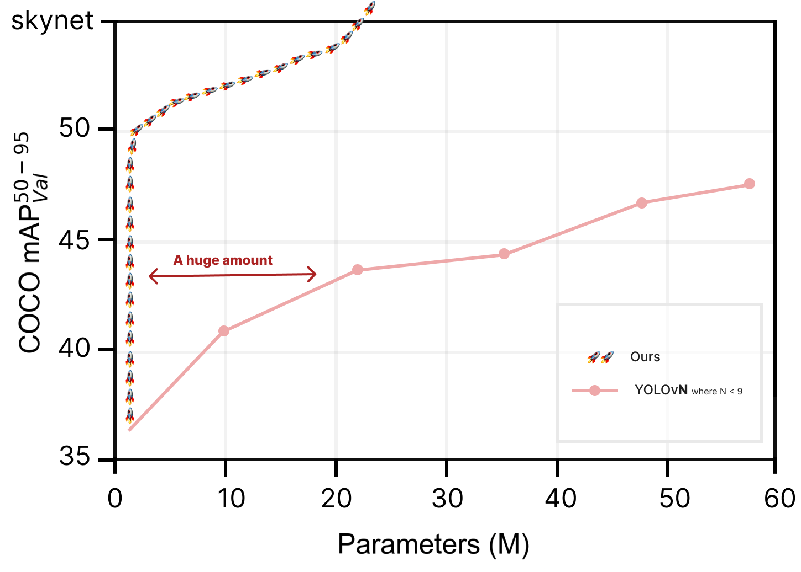

# Official YOLOv{{ cookiecutter.yolo_version }}

Implementation of paper - [YOLOv{{ cookiecutter.yolo_version }}](https://www.youtube.com/watch?v=dQw4w9WgXcQ)

We achieved `skynet` on COCO dataset



## Installation

```
pip install {{ cookiecutter.project_name }}
```